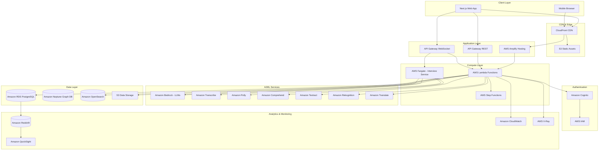
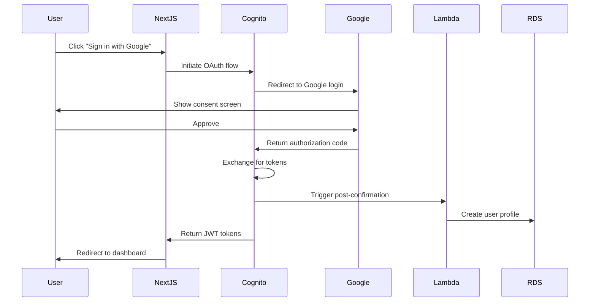
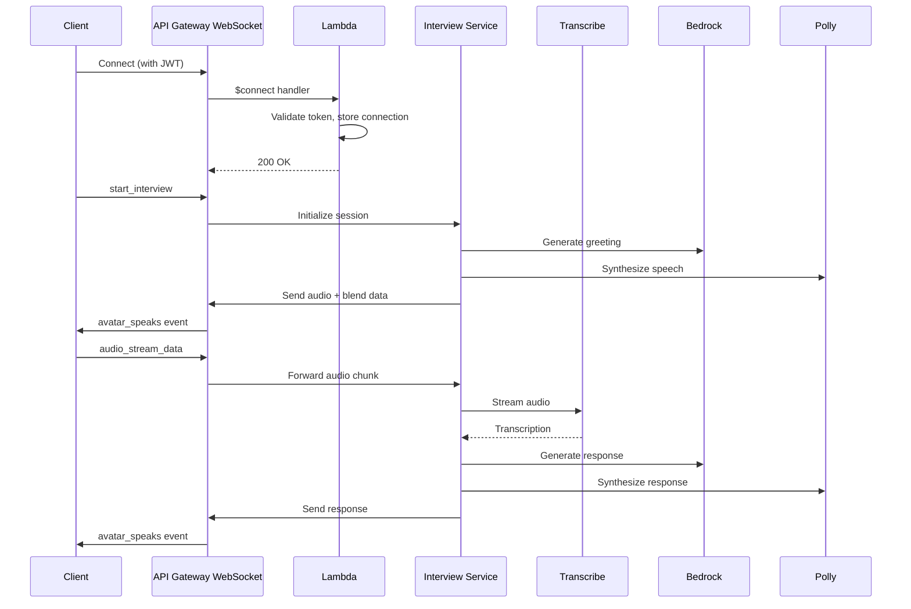
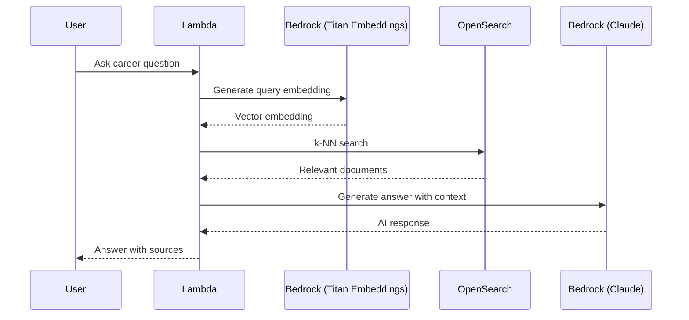
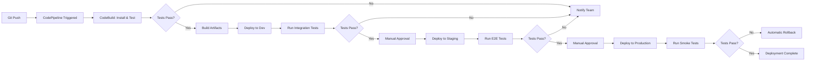

# Design Document

## Overview

This document provides a comprehensive architectural design for implementing the Pravartak AI Career Coach platform on Amazon Web Services (AWS). The platform is a Next.js-based web application that provides AI-powered career development tools including resume building, mock interviews with 3D avatars, CV analysis, cover letter generation, and personalized career roadmaps.

The design leverages AWS-native services to create a scalable, secure, and cost-effective infrastructure that supports:
- Serverless compute for backend logic
- Real-time WebSocket communication for mock interviews
- AI/ML services for natural language processing and speech synthesis
- Managed databases for relational and graph data
- Global content delivery and static asset hosting
- Comprehensive monitoring and observability

## Architecture

### High-Level Architecture Diagram



### Architecture Principles

1. **Serverless-First**: Utilize AWS Lambda and managed services to minimize operational overhead
2. **Scalability**: Auto-scaling at every layer to handle variable workloads
3. **Security**: Defense-in-depth with IAM, encryption at rest and in transit, and network isolation
4. **Cost Optimization**: Pay-per-use pricing models and intelligent resource allocation
5. **High Availability**: Multi-AZ deployments for critical components
6. **Observability**: Comprehensive logging, metrics, and distributed tracing

## Components and Interfaces

### 1. Frontend Hosting and Content Delivery

#### AWS Amplify Hosting

**Purpose**: Host the Next.js application with automatic CI/CD integration

**Configuration**:
- Build settings: `npm run build`
- Environment variables: Injected from AWS Systems Manager Parameter Store
- Branch deployments: Main branch for production, feature branches for preview
- Custom domain: Configured with Route 53 and ACM certificates

**Integration Points**:
- GitHub repository for source code
- CloudFront for CDN distribution
- Cognito for authentication
- API Gateway for backend APIs

#### Amazon S3 + CloudFront

**Purpose**: Serve static assets (images, fonts, CSS, JS bundles) with global CDN

**S3 Bucket Configuration**:
- Bucket name: `pravartak-static-assets-{env}`
- Versioning: Enabled
- Encryption: AES-256 (SSE-S3)
- Lifecycle policies: Transition to Glacier after 90 days for old versions
- CORS: Configured for cross-origin requests

**CloudFront Distribution**:
- Origin: S3 bucket
- Cache behavior: Cache based on query strings and headers
- TTL: 1 year for immutable assets, 5 minutes for dynamic content
- Compression: Gzip and Brotli enabled
- Security: Origin Access Identity (OAI) for S3 access
- Custom domain: assets.pravartak.ai

### 2. Authentication and Identity Management

#### Amazon Cognito User Pools

**Purpose**: Manage user authentication and authorization

**Configuration**:
- User attributes: email (required), name, phone, custom attributes (industry, experience)
- Password policy: Minimum 8 characters, uppercase, lowercase, numbers, special characters
- MFA: Optional SMS or TOTP
- Account recovery: Email verification
- Lambda triggers:
  - Pre-signup: Email validation
  - Post-confirmation: Create user profile in RDS
  - Pre-token generation: Add custom claims

**User Pool Structure**:
```json
{
  "UserPoolId": "us-east-1_XXXXXXX",
  "ClientId": "web-client-id",
  "IdentityPoolId": "us-east-1:xxxxx-xxxx-xxxx",
  "Domain": "pravartak-auth.auth.us-east-1.amazoncognito.com"
}
```

#### Cognito Federated Identities

**Purpose**: Enable social login with Google OAuth

**Configuration**:
- Identity providers: Google
- Authenticated role: Access to user-specific S3 folders, API Gateway
- Unauthenticated role: Limited read-only access
- Attribute mapping: Google email → Cognito email

**Integration Flow**:



### 3. API Layer

#### Amazon API Gateway (REST)

**Purpose**: Expose RESTful APIs for Next.js server actions and backend logic

**Configuration**:
- API type: Regional REST API
- Authorization: Cognito User Pool authorizer
- Throttling: 10,000 requests per second, burst 5,000
- CORS: Enabled for web client origins
- Request validation: JSON schema validation
- Response caching: 5 minutes for GET requests

**API Endpoints**:
- `/api/users` - User profile management
- `/api/resumes` - Resume CRUD operations
- `/api/cover-letters` - Cover letter generation
- `/api/cv-analysis` - CV parsing and analysis
- `/api/interviews` - Interview preparation
- `/api/analytics` - User progress analytics
- `/api/industry-insights` - Market data

**Integration**:
- Lambda proxy integration for all endpoints
- VPC Link for private resources (RDS, OpenSearch)

#### Amazon API Gateway (WebSocket)

**Purpose**: Real-time bidirectional communication for mock interviews

**Configuration**:
- Connection management: DynamoDB table for connection IDs
- Routes:
  - `$connect`: Authenticate and store connection
  - `$disconnect`: Clean up connection
  - `start_interview`: Initialize interview session
  - `audio_stream_data`: Stream audio chunks
  - `audio_stream_end`: Finalize transcription
- Authorization: Custom Lambda authorizer validating Cognito JWT
- Idle timeout: 10 minutes

**WebSocket Flow**:



### 4. Compute Layer

#### AWS Lambda Functions

**Purpose**: Execute serverless backend logic for API requests

**Function Categories**:

1. **User Management Functions**
   - `user-profile-handler`: CRUD operations for user profiles
   - `user-activity-tracker`: Log user activities
   - Memory: 512 MB, Timeout: 30s

2. **Resume Functions**
   - `resume-crud-handler`: Create, read, update, delete resumes
   - `resume-pdf-generator`: Generate PDF from resume JSON
   - Memory: 1024 MB, Timeout: 60s

3. **AI Processing Functions**
   - `cv-analyzer`: Parse and analyze CVs using Textract and Bedrock
   - `cover-letter-generator`: Generate personalized cover letters
   - `skill-gap-analyzer`: Identify skill gaps using Bedrock
   - Memory: 2048 MB, Timeout: 120s

4. **Interview Functions**
   - `interview-prep-handler`: Manage interview preparation sessions
   - `mock-interview-scorer`: Score and provide feedback
   - Memory: 1024 MB, Timeout: 60s

5. **Analytics Functions**
   - `dashboard-aggregator`: Aggregate user progress metrics
   - `industry-insights-fetcher`: Retrieve market data
   - Memory: 512 MB, Timeout: 30s

**Common Configuration**:
- Runtime: Node.js 20.x
- VPC: Attached to private subnets for RDS/OpenSearch access
- Environment variables: Injected from Parameter Store
- IAM roles: Least privilege access to required services
- Concurrency: Reserved concurrency for critical functions
- Dead letter queue: SQS for failed invocations
- X-Ray tracing: Enabled for all functions

#### AWS Fargate (ECS) - Interview Service

**Purpose**: Run the Flask-based real-time interview service as a containerized application

**Container Configuration**:

- Base image: `python:3.11-slim`
- CPU: 1 vCPU
- Memory: 2 GB
- Port: 8000 (Flask app)
- Health check: `/health` endpoint
- Auto-scaling: 2-10 tasks based on CPU/memory utilization

**ECS Cluster**:
- Launch type: Fargate
- Network mode: awsvpc
- VPC: Private subnets with NAT Gateway
- Service discovery: AWS Cloud Map for internal DNS

**Task Definition**:
```json
{
  "family": "pravartak-interview-service",
  "networkMode": "awsvpc",
  "requiresCompatibilities": ["FARGATE"],
  "cpu": "1024",
  "memory": "2048",
  "containerDefinitions": [
    {
      "name": "interview-service",
      "image": "pravartak-interview:latest",
      "portMappings": [{"containerPort": 8000, "protocol": "tcp"}],
      "environment": [
        {"name": "AWS_REGION", "value": "us-east-1"},
        {"name": "BEDROCK_MODEL", "value": "anthropic.claude-v2"}
      ],
      "secrets": [
        {"name": "DATABASE_URL", "valueFrom": "arn:aws:secretsmanager:..."}
      ],
      "logConfiguration": {
        "logDriver": "awslogs",
        "options": {
          "awslogs-group": "/ecs/interview-service",
          "awslogs-region": "us-east-1",
          "awslogs-stream-prefix": "ecs"
        }
      }
    }
  ]
}
```

**Integration with WebSocket API**:
- Application Load Balancer (ALB) in front of Fargate tasks
- ALB target group with health checks
- Lambda function forwards WebSocket messages to ALB

#### AWS Step Functions

**Purpose**: Orchestrate complex multi-step workflows

**State Machines**:

1. **Resume Analysis Workflow**
   - Parse document with Textract
   - Extract structured data
   - Analyze with Bedrock
   - Generate ATS score
   - Store results in RDS
   - Send notification

2. **Interview Feedback Workflow**
   - Retrieve interview responses
   - Analyze with Comprehend (sentiment)
   - Generate feedback with Bedrock
   - Calculate scores
   - Store in RDS
   - Send email summary

3. **Career Roadmap Generation**
   - Fetch user profile and skills
   - Query industry insights
   - Identify skill gaps with Bedrock
   - Generate learning path
   - Store in OpenSearch
   - Return roadmap

**Example State Machine (Resume Analysis)**:

```json
{
  "StartAt": "ParseDocument",
  "States": {
    "ParseDocument": {
      "Type": "Task",
      "Resource": "arn:aws:lambda:us-east-1:xxx:function:textract-parser",
      "Next": "ExtractData"
    },
    "ExtractData": {
      "Type": "Task",
      "Resource": "arn:aws:lambda:us-east-1:xxx:function:data-extractor",
      "Next": "AnalyzeWithAI"
    },
    "AnalyzeWithAI": {
      "Type": "Task",
      "Resource": "arn:aws:lambda:us-east-1:xxx:function:bedrock-analyzer",
      "Next": "CalculateScore"
    },
    "CalculateScore": {
      "Type": "Task",
      "Resource": "arn:aws:lambda:us-east-1:xxx:function:ats-scorer",
      "Next": "StoreResults"
    },
    "StoreResults": {
      "Type": "Task",
      "Resource": "arn:aws:lambda:us-east-1:xxx:function:rds-writer",
      "End": true
    }
  }
}
```

### 5. AI/ML Services

#### Amazon Bedrock

**Purpose**: Provide foundation models for natural language processing

**Models Used**:
- **Claude 3 Sonnet** (anthropic.claude-3-sonnet-20240229-v1:0): Primary model for CV analysis, cover letter generation, interview feedback
- **Claude 3 Haiku** (anthropic.claude-3-haiku-20240307-v1:0): Fast responses for chat and quick queries
- **Titan Embeddings** (amazon.titan-embed-text-v1): Generate embeddings for RAG pipeline

**Use Cases**:
1. **CV Analysis**: Extract skills, experience, education; provide improvement suggestions
2. **Cover Letter Generation**: Create personalized cover letters based on job description and resume
3. **Skill Gap Identification**: Compare user skills with industry requirements
4. **Interview Question Generation**: Generate relevant interview questions
5. **Interview Feedback**: Analyze responses and provide constructive feedback
6. **Career Roadmap**: Generate personalized learning paths

**API Integration Pattern**:
```python
import boto3
import json

bedrock = boto3.client('bedrock-runtime', region_name='us-east-1')

def analyze_cv(cv_text):
    prompt = f"""Analyze this CV and provide:
    1. Key skills identified
    2. Years of experience
    3. Education level
    4. ATS optimization score (0-100)
    5. Improvement suggestions
    
    CV: {cv_text}"""
    
    response = bedrock.invoke_model(
        modelId='anthropic.claude-3-sonnet-20240229-v1:0',
        body=json.dumps({
            "anthropic_version": "bedrock-2023-05-31",
            "max_tokens": 2000,
            "messages": [{"role": "user", "content": prompt}]
        })
    )
    
    return json.loads(response['body'].read())
```

#### Amazon Transcribe

**Purpose**: Convert speech to text for mock interviews

**Configuration**:
- Language: English (en-US)
- Streaming: Real-time transcription
- Custom vocabulary: Industry-specific terms
- Speaker identification: Enabled
- Profanity filtering: Disabled (professional context)
- Automatic punctuation: Enabled

**Integration**:

- WebSocket audio stream from client
- Fargate service buffers and sends to Transcribe
- Real-time transcription results sent back to client
- Final transcript stored in RDS

#### Amazon Polly

**Purpose**: Synthesize natural-sounding speech for AI interviewer

**Configuration**:
- Voice: Joanna (Neural, en-US) - Professional female voice
- Engine: Neural
- Output format: MP3
- Sample rate: 24000 Hz
- Speech marks: Enabled for lip-sync (viseme data)

**Viseme Integration**:
- Polly returns speech marks with viseme codes
- Map viseme codes to 3D avatar blend shapes
- Synchronize audio playback with facial animations

**API Usage**:
```python
import boto3

polly = boto3.client('polly', region_name='us-east-1')

def synthesize_speech(text):
    response = polly.synthesize_speech(
        Text=text,
        OutputFormat='mp3',
        VoiceId='Joanna',
        Engine='neural',
        SpeechMarkTypes=['viseme']
    )
    
    audio_stream = response['AudioStream'].read()
    
    # Get viseme data for lip-sync
    viseme_response = polly.synthesize_speech(
        Text=text,
        OutputFormat='json',
        VoiceId='Joanna',
        Engine='neural',
        SpeechMarkTypes=['viseme']
    )
    
    return audio_stream, viseme_response['AudioStream'].read()
```

#### Amazon Comprehend

**Purpose**: Analyze sentiment and extract insights from interview responses

**Features Used**:
- Sentiment analysis: Positive, negative, neutral, mixed
- Key phrase extraction: Important topics mentioned
- Entity recognition: Names, organizations, locations
- Syntax analysis: Parts of speech

**Use Cases**:
- Evaluate candidate confidence during interviews
- Identify areas of strength and weakness
- Generate feedback based on communication patterns

#### Amazon Textract

**Purpose**: Extract text and structured data from uploaded documents

**Features**:
- Text detection: Extract all text from PDFs and images
- Form extraction: Key-value pairs from structured forms
- Table extraction: Tabular data from documents
- Layout analysis: Understand document structure

**Resume Parsing Flow**:
1. User uploads resume (PDF/DOCX/image)
2. Convert to PDF if needed
3. Upload to S3
4. Trigger Textract analysis
5. Extract sections: contact info, experience, education, skills
6. Structure data into JSON
7. Store in RDS

#### Amazon Rekognition

**Purpose**: Analyze images for profile pictures and portfolio content

**Features**:
- Face detection: Validate profile pictures
- Object detection: Analyze portfolio images
- Text in image: Extract text from screenshots
- Content moderation: Filter inappropriate content

#### Amazon Translate

**Purpose**: Support multi-language content

**Configuration**:
- Source language: Auto-detect
- Target languages: Spanish, French, German, Hindi, Chinese
- Custom terminology: Career-specific terms

**Use Cases**:
- Translate job descriptions
- Translate industry insights
- Multi-language resume support

### 6. Data Layer

#### Amazon RDS (PostgreSQL)

**Purpose**: Primary relational database for structured data

**Configuration**:

- Engine: PostgreSQL 15.x
- Instance class: db.t4g.medium (production: db.r6g.xlarge)
- Storage: 100 GB GP3 SSD with auto-scaling to 1 TB
- Multi-AZ: Enabled for high availability
- Backup: Automated daily backups, 7-day retention
- Encryption: At rest with AWS KMS, in transit with SSL
- Parameter group: Custom with optimized settings
- Maintenance window: Sunday 3:00-4:00 AM UTC

**Database Schema**: Uses existing Prisma schema with models for:
- Users, UserProfile, UserActivity
- Resume, CoverLetter
- MockInterview, InterviewPrep
- JobApplication
- Assessment, ChatSession
- LearningResource, Notification
- IndustryInsight

**Connection Management**:
- RDS Proxy for connection pooling
- IAM authentication for Lambda functions
- Secrets Manager for credentials rotation

**Performance Optimization**:
- Indexes on frequently queried columns
- Materialized views for analytics
- Read replicas for reporting queries

#### Amazon Neptune (Graph Database)

**Purpose**: Store and query dynamic knowledge graph for career paths and skill relationships

**Configuration**:
- Instance type: db.r6g.large
- Storage: Auto-scaling
- Replication: 2 read replicas
- Backup: Continuous backup to S3
- Query language: Gremlin

**Graph Schema**:
```
Vertices:
- User (id, name, email)
- Skill (id, name, category, demand_level)
- Job (id, title, company, industry)
- Course (id, title, provider, duration)
- Industry (id, name, growth_rate)

Edges:
- User -[HAS_SKILL]-> Skill (proficiency_level, years)
- User -[APPLIED_TO]-> Job (status, date)
- Job -[REQUIRES]-> Skill (importance, level)
- Skill -[PREREQUISITE_FOR]-> Skill
- Course -[TEACHES]-> Skill
- Job -[IN_INDUSTRY]-> Industry
- User -[INTERESTED_IN]-> Industry
```

**Use Cases**:
- Career path recommendations
- Skill gap analysis with graph traversal
- Learning path generation
- Job matching based on skill overlap

**Query Example (Gremlin)**:
```groovy
// Find recommended courses for user's skill gaps
g.V().has('User', 'id', userId)
  .out('INTERESTED_IN')
  .in('IN_INDUSTRY')
  .out('REQUIRES')
  .where(not(__.in('HAS_SKILL').has('User', 'id', userId)))
  .in('TEACHES')
  .dedup()
  .limit(10)
```

#### Amazon OpenSearch

**Purpose**: Full-text search, vector embeddings, and analytics

**Configuration**:
- Version: OpenSearch 2.11
- Instance type: r6g.large.search (3 nodes)
- Storage: 100 GB EBS per node
- Dedicated master nodes: 3 x m6g.large.search
- Encryption: At rest and in transit
- Fine-grained access control: Enabled with IAM

**Indices**:

1. **users-index**
   - Fields: name, email, bio, skills, experience
   - Use case: User search

2. **resumes-index**
   - Fields: title, content, skills, experience, education
   - Use case: Resume search and matching

3. **jobs-index**
   - Fields: title, company, description, requirements, location
   - Use case: Job search and recommendations

4. **embeddings-index**
   - Fields: text, vector (768 dimensions), metadata
   - Use case: Semantic search and RAG pipeline
   - Vector engine: k-NN with HNSW algorithm

**RAG Pipeline**:



#### Amazon S3 (Data Storage)

**Purpose**: Store user-uploaded files, generated documents, and backups

**Buckets**:

1. **pravartak-user-uploads-{env}**
   - Purpose: User-uploaded resumes, cover letters, profile pictures
   - Encryption: SSE-S3
   - Versioning: Enabled
   - Lifecycle: Delete after 90 days if not accessed
   - Access: Pre-signed URLs with 1-hour expiration

2. **pravartak-generated-documents-{env}**
   - Purpose: Generated PDFs, reports
   - Encryption: SSE-S3
   - Lifecycle: Transition to Glacier after 30 days
   - Access: CloudFront distribution

3. **pravartak-backups-{env}**
   - Purpose: Database backups, logs
   - Encryption: SSE-KMS
   - Versioning: Enabled
   - Lifecycle: Retain for 1 year, then delete
   - Access: Restricted to backup Lambda functions

**S3 Event Notifications**:
- Trigger Lambda on new resume upload for parsing
- Trigger Lambda on profile picture upload for validation

### 7. Analytics and Business Intelligence

#### Amazon Redshift

**Purpose**: Data warehouse for analytics and reporting

**Configuration**:
- Node type: dc2.large (2 nodes)
- Cluster: Multi-node
- Encryption: At rest with KMS
- Automated snapshots: Daily, 7-day retention
- Concurrency scaling: Enabled

**Data Model**:
- Fact tables: user_activities, interview_sessions, job_applications
- Dimension tables: users, dates, industries, skills
- Star schema for efficient querying

**ETL Pipeline**:
- AWS Glue jobs extract data from RDS
- Transform and aggregate data
- Load into Redshift on daily schedule
- Incremental loads for large tables

#### AWS Glue

**Purpose**: ETL service for data transformation and loading

**Jobs**:

1. **RDS to Redshift ETL**
   - Extract: Read from RDS using JDBC
   - Transform: Aggregate metrics, clean data
   - Load: Write to Redshift
   - Schedule: Daily at 2:00 AM UTC

2. **S3 Data Lake Crawler**
   - Crawl S3 buckets for logs and exports
   - Create/update Glue Data Catalog
   - Enable Athena queries

**Glue Data Catalog**:
- Centralized metadata repository
- Tables for RDS, S3, Redshift
- Used by Athena, Redshift Spectrum

#### Amazon Athena

**Purpose**: Serverless SQL queries on S3 data

**Use Cases**:
- Ad-hoc analysis of CloudWatch logs
- Query historical data in S3
- Cost analysis and optimization

**Configuration**:
- Workgroup: Primary with result encryption
- Query result location: s3://pravartak-athena-results/
- Data catalog: AWS Glue

#### Amazon QuickSight

**Purpose**: Business intelligence dashboards

**Dashboards**:

1. **User Engagement Dashboard**
   - Active users (daily, weekly, monthly)
   - Feature usage breakdown
   - User retention cohorts

2. **Interview Analytics Dashboard**
   - Mock interviews completed
   - Average scores by industry
   - Common improvement areas

3. **Resume Analytics Dashboard**
   - Resumes created/updated
   - ATS score distribution
   - Popular templates

4. **Business Metrics Dashboard**
   - Revenue metrics
   - Conversion funnels
   - User acquisition channels

**Data Sources**:
- Redshift for aggregated data
- Athena for S3 data
- RDS for real-time metrics

### 8. Monitoring and Observability

#### Amazon CloudWatch

**Logs**:

- Log groups for each Lambda function
- ECS task logs
- API Gateway access logs
- RDS slow query logs
- Application logs from Next.js

**Metrics**:
- Lambda invocations, duration, errors
- API Gateway requests, latency, 4xx/5xx errors
- RDS CPU, memory, connections, IOPS
- ECS CPU, memory utilization
- Custom metrics: User signups, resumes created, interviews completed

**Alarms**:
- Lambda error rate > 5%
- API Gateway 5xx errors > 1%
- RDS CPU > 80%
- ECS task failures
- Bedrock throttling errors

**Dashboards**:
- System health overview
- API performance
- Database performance
- Cost tracking

#### AWS X-Ray

**Purpose**: Distributed tracing for request flow analysis

**Configuration**:
- Enabled on all Lambda functions
- API Gateway tracing enabled
- Custom segments for Bedrock calls
- Sampling rate: 10% for normal traffic, 100% for errors

**Trace Analysis**:
- Identify bottlenecks in request processing
- Analyze cold start impact
- Track external service latency (Bedrock, Transcribe, Polly)

#### AWS CloudTrail

**Purpose**: Audit logging for security and compliance

**Configuration**:
- Log all API calls
- Store in S3 with encryption
- Enable log file validation
- Integrate with CloudWatch Logs for real-time monitoring

**Monitored Events**:
- IAM changes
- S3 bucket policy modifications
- RDS configuration changes
- Cognito user pool updates

## Data Models

### User Profile Data Model

```typescript
interface User {
  id: string;
  cognitoUserId: string;
  email: string;
  name: string;
  imageUrl?: string;
  industry?: string;
  bio?: string;
  experience?: number;
  phone?: string;
  location?: string;
  linkedIn?: string;
  portfolio?: string;
  skills: string[];
  createdAt: Date;
  updatedAt: Date;
}

interface UserProfile {
  id: string;
  userId: string;
  hasBasicInfo: boolean;
  hasExperience: boolean;
  hasEducation: boolean;
  hasSkills: boolean;
  hasResume: boolean;
  hasCoverLetter: boolean;
  hasCompletedMockInterview: boolean;
  experience: WorkExperience[];
  education: Education[];
  certifications: Certification[];
  projects: Project[];
  languages: Language[];
  preferredLocations: string[];
  preferredJobTypes: string[];
  preferredIndustries: string[];
  salaryExpectation?: number;
  updatedAt: Date;
}
```

### Resume Data Model

```typescript
interface Resume {
  id: string;
  userId: string;
  title: string;
  content: ResumeContent;
  templateId?: string;
  version: number;
  status: 'DRAFT' | 'COMPLETED' | 'ARCHIVED';
  atsScore?: number;
  feedback?: string;
  pdfUrl?: string;
  isDefault: boolean;
  shareToken?: string;
  downloadCount: number;
  createdAt: Date;
  updatedAt: Date;
}

interface ResumeContent {
  personalInfo: PersonalInfo;
  summary: string;
  experience: WorkExperience[];
  education: Education[];
  skills: Skill[];
  certifications: Certification[];
  projects: Project[];
}
```

### Mock Interview Data Model

```typescript
interface MockInterview {
  id: string;
  userId: string;
  type: 'BEHAVIORAL' | 'TECHNICAL' | 'CASE_STUDY' | 'GENERAL';
  industry?: string;
  experienceLevel?: string;
  duration: number;
  questions: InterviewQuestion[];
  responses: InterviewResponse[];
  overallScore?: number;
  communicationScore?: number;
  contentScore?: number;
  clarityScore?: number;
  feedback?: QuestionFeedback[];
  strengths: string[];
  improvements: string[];
  recommendations: string[];
  completedAt: Date;
}

interface InterviewQuestion {
  id: string;
  question: string;
  type: string;
  difficulty: string;
}

interface InterviewResponse {
  questionId: string;
  answer: string;
  audioUrl?: string;
  responseTime: number;
  confidence: number;
}
```

## Error Handling

### Error Categories

1. **Client Errors (4xx)**
   - 400 Bad Request: Invalid input data
   - 401 Unauthorized: Missing or invalid authentication
   - 403 Forbidden: Insufficient permissions
   - 404 Not Found: Resource doesn't exist
   - 429 Too Many Requests: Rate limit exceeded

2. **Server Errors (5xx)**
   - 500 Internal Server Error: Unexpected error
   - 502 Bad Gateway: Upstream service failure
   - 503 Service Unavailable: Service temporarily down
   - 504 Gateway Timeout: Request timeout

### Error Handling Strategy

#### Lambda Functions

```typescript
export const handler = async (event: APIGatewayProxyEvent) => {
  try {
    // Business logic
    const result = await processRequest(event);
    
    return {
      statusCode: 200,
      headers: corsHeaders,
      body: JSON.stringify(result)
    };
  } catch (error) {
    console.error('Error processing request:', error);
    
    // Log to CloudWatch
    await logError(error, event);
    
    // Send to X-Ray
    if (error instanceof ValidationError) {
      return {
        statusCode: 400,
        headers: corsHeaders,
        body: JSON.stringify({ error: error.message })
      };
    }
    
    if (error instanceof AuthenticationError) {
      return {
        statusCode: 401,
        headers: corsHeaders,
        body: JSON.stringify({ error: 'Unauthorized' })
      };
    }
    
    // Generic error response
    return {
      statusCode: 500,
      headers: corsHeaders,
      body: JSON.stringify({ error: 'Internal server error' })
    };
  }
};
```

#### Retry Logic

**Exponential Backoff for External Services**:

```typescript
async function callBedrockWithRetry(params: BedrockParams, maxRetries = 3) {
  for (let attempt = 1; attempt <= maxRetries; attempt++) {
    try {
      return await bedrock.invokeModel(params);
    } catch (error) {
      if (attempt === maxRetries) throw error;
      
      if (error.code === 'ThrottlingException') {
        const delay = Math.min(1000 * Math.pow(2, attempt), 10000);
        await sleep(delay);
        continue;
      }
      
      throw error;
    }
  }
}
```

#### Circuit Breaker Pattern

```typescript
class CircuitBreaker {
  private failureCount = 0;
  private lastFailureTime = 0;
  private state: 'CLOSED' | 'OPEN' | 'HALF_OPEN' = 'CLOSED';
  
  async execute<T>(fn: () => Promise<T>): Promise<T> {
    if (this.state === 'OPEN') {
      if (Date.now() - this.lastFailureTime > 60000) {
        this.state = 'HALF_OPEN';
      } else {
        throw new Error('Circuit breaker is OPEN');
      }
    }
    
    try {
      const result = await fn();
      this.onSuccess();
      return result;
    } catch (error) {
      this.onFailure();
      throw error;
    }
  }
  
  private onSuccess() {
    this.failureCount = 0;
    this.state = 'CLOSED';
  }
  
  private onFailure() {
    this.failureCount++;
    this.lastFailureTime = Date.now();
    
    if (this.failureCount >= 5) {
      this.state = 'OPEN';
    }
  }
}
```

#### Dead Letter Queues

- Lambda functions configured with SQS DLQ
- Failed messages retained for 14 days
- CloudWatch alarm on DLQ message count
- Manual review and reprocessing workflow

## Testing Strategy

### Unit Testing

**Lambda Functions**:
- Framework: Jest
- Coverage target: 80%
- Mock AWS SDK calls
- Test business logic in isolation

```typescript
describe('CV Analyzer', () => {
  it('should extract skills from CV text', async () => {
    const mockTextract = jest.fn().mockResolvedValue({
      Blocks: [/* mock data */]
    });
    
    const result = await analyzeCv(mockCvData);
    
    expect(result.skills).toContain('JavaScript');
    expect(result.atsScore).toBeGreaterThan(70);
  });
});
```

### Integration Testing

**API Endpoints**:
- Framework: Supertest
- Test against deployed dev environment
- Validate request/response schemas
- Test authentication flows

```typescript
describe('Resume API', () => {
  it('should create a new resume', async () => {
    const response = await request(apiUrl)
      .post('/api/resumes')
      .set('Authorization', `Bearer ${testToken}`)
      .send(mockResumeData)
      .expect(201);
    
    expect(response.body.id).toBeDefined();
    expect(response.body.status).toBe('DRAFT');
  });
});
```

### End-to-End Testing

**User Flows**:
- Framework: Playwright
- Test critical user journeys
- Run in CI/CD pipeline

**Test Scenarios**:
1. User registration and login
2. Create and edit resume
3. Generate cover letter
4. Complete mock interview
5. View analytics dashboard

### Load Testing

**Tools**: Artillery, AWS Distributed Load Testing

**Scenarios**:
- 1000 concurrent users
- Sustained load for 30 minutes
- Spike test: 0 to 5000 users in 1 minute

**Metrics**:
- Response time p95 < 500ms
- Error rate < 0.1%
- Successful requests > 99.9%

### Security Testing

**Automated Scans**:
- AWS Inspector for vulnerability scanning
- Dependabot for dependency updates
- OWASP ZAP for web application security

**Manual Testing**:
- Penetration testing quarterly
- Security code reviews
- IAM policy audits

## Deployment Strategy

### CI/CD Pipeline



### Infrastructure as Code

**AWS CDK (TypeScript)**:

```typescript
import * as cdk from 'aws-cdk-lib';
import * as lambda from 'aws-cdk-lib/aws-lambda';
import * as apigateway from 'aws-cdk-lib/aws-apigateway';
import * as rds from 'aws-cdk-lib/aws-rds';
import * as cognito from 'aws-cdk-lib/aws-cognito';

export class PravartakStack extends cdk.Stack {
  constructor(scope: cdk.App, id: string, props?: cdk.StackProps) {
    super(scope, id, props);
    
    // VPC
    const vpc = new ec2.Vpc(this, 'PravartakVPC', {
      maxAzs: 2,
      natGateways: 1
    });
    
    // Cognito User Pool
    const userPool = new cognito.UserPool(this, 'UserPool', {
      selfSignUpEnabled: true,
      signInAliases: { email: true },
      autoVerify: { email: true },
      passwordPolicy: {
        minLength: 8,
        requireLowercase: true,
        requireUppercase: true,
        requireDigits: true,
        requireSymbols: true
      }
    });
    
    // RDS Database
    const database = new rds.DatabaseInstance(this, 'Database', {
      engine: rds.DatabaseInstanceEngine.postgres({
        version: rds.PostgresEngineVersion.VER_15
      }),
      instanceType: ec2.InstanceType.of(
        ec2.InstanceClass.T4G,
        ec2.InstanceSize.MEDIUM
      ),
      vpc,
      multiAz: true,
      allocatedStorage: 100,
      storageEncrypted: true,
      backupRetention: cdk.Duration.days(7)
    });
    
    // Lambda Function
    const apiHandler = new lambda.Function(this, 'ApiHandler', {
      runtime: lambda.Runtime.NODEJS_20_X,
      handler: 'index.handler',
      code: lambda.Code.fromAsset('lambda'),
      environment: {
        DATABASE_URL: database.secret!.secretValueFromJson('connectionString').toString(),
        USER_POOL_ID: userPool.userPoolId
      },
      vpc,
      timeout: cdk.Duration.seconds(30),
      memorySize: 512
    });
    
    // API Gateway
    const api = new apigateway.RestApi(this, 'Api', {
      restApiName: 'Pravartak API',
      defaultCorsPreflightOptions: {
        allowOrigins: apigateway.Cors.ALL_ORIGINS,
        allowMethods: apigateway.Cors.ALL_METHODS
      }
    });
    
    const integration = new apigateway.LambdaIntegration(apiHandler);
    api.root.addMethod('ANY', integration);
  }
}
```

### Blue-Green Deployment

**Lambda Versions and Aliases**:
- Each deployment creates a new version
- Alias points to current version
- Traffic shifting: 10% → 50% → 100% over 30 minutes
- Automatic rollback on CloudWatch alarms

**Amplify Hosting**:
- Branch-based deployments
- Preview environments for pull requests
- Atomic deployments with instant rollback

### Database Migrations

**Prisma Migrate**:
```bash
# Generate migration
npx prisma migrate dev --name add_new_field

# Apply to production
npx prisma migrate deploy
```

**Migration Strategy**:
1. Create migration in dev environment
2. Test migration on staging database
3. Schedule maintenance window for production
4. Apply migration with backup
5. Verify data integrity
6. Deploy application code

## Security Architecture

### Network Security

**VPC Configuration**:
- Public subnets: ALB, NAT Gateway
- Private subnets: Lambda, RDS, ECS, OpenSearch
- Isolated subnets: Database backups

**Security Groups**:
- ALB: Allow 443 from 0.0.0.0/0
- Lambda: Allow outbound to RDS, OpenSearch
- RDS: Allow 5432 from Lambda security group
- ECS: Allow 8000 from ALB

**Network ACLs**:
- Default allow for private subnets
- Explicit deny for known malicious IPs

### IAM Security

**Principle of Least Privilege**:
- Each Lambda function has unique role
- Roles grant only required permissions
- Resource-based policies for cross-account access

**Example Lambda Role**:
```json
{
  "Version": "2012-10-17",
  "Statement": [
    {
      "Effect": "Allow",
      "Action": [
        "logs:CreateLogGroup",
        "logs:CreateLogStream",
        "logs:PutLogEvents"
      ],
      "Resource": "arn:aws:logs:*:*:*"
    },
    {
      "Effect": "Allow",
      "Action": [
        "bedrock:InvokeModel"
      ],
      "Resource": "arn:aws:bedrock:us-east-1::foundation-model/anthropic.claude-*"
    },
    {
      "Effect": "Allow",
      "Action": [
        "rds-db:connect"
      ],
      "Resource": "arn:aws:rds-db:us-east-1:*:dbuser:*/pravartak_app"
    }
  ]
}
```

### Data Encryption

**At Rest**:
- S3: SSE-S3 or SSE-KMS
- RDS: KMS encryption
- EBS volumes: KMS encryption
- OpenSearch: KMS encryption

**In Transit**:
- TLS 1.2+ for all API calls
- SSL for RDS connections
- HTTPS for CloudFront distributions

### Secrets Management

**AWS Secrets Manager**:
- Database credentials
- API keys for third-party services
- Automatic rotation for RDS passwords

**AWS Systems Manager Parameter Store**:
- Application configuration
- Non-sensitive environment variables
- Feature flags

### Compliance

**GDPR Compliance**:
- User data deletion API
- Data export functionality
- Consent management
- Data retention policies

**SOC 2 Compliance**:
- Access logging with CloudTrail
- Encryption at rest and in transit
- Regular security audits
- Incident response procedures

## Cost Optimization

### Compute Optimization

**Lambda**:
- Right-size memory allocation
- Use ARM64 (Graviton2) for 20% cost savings
- Reserved concurrency for predictable workloads

**Fargate**:
- Use Fargate Spot for non-critical tasks (70% savings)
- Right-size CPU and memory
- Auto-scaling based on metrics

### Storage Optimization

**S3**:
- Intelligent-Tiering for variable access patterns
- Lifecycle policies to Glacier
- Delete incomplete multipart uploads after 7 days

**RDS**:
- Reserved instances for production (40% savings)
- Use GP3 instead of GP2 for storage
- Delete old automated snapshots

### Data Transfer Optimization

**CloudFront**:
- Cache static assets aggressively
- Use Origin Shield for popular content
- Compress responses

**VPC**:
- Use VPC endpoints for AWS services (avoid NAT Gateway costs)
- Consolidate traffic through fewer NAT Gateways

### Monitoring and Alerts

**Cost Anomaly Detection**:
- AWS Cost Anomaly Detection enabled
- Alerts on 20% cost increase
- Daily cost reports to team

**Budget Alerts**:
- Monthly budget: $5,000
- Alert at 80% and 100%
- Forecast alerts for projected overruns

## Disaster Recovery

### Backup Strategy

**RDS**:
- Automated daily backups (7-day retention)
- Manual snapshots before major changes
- Cross-region backup replication

**S3**:
- Versioning enabled
- Cross-region replication for critical buckets
- MFA delete for production buckets

**DynamoDB** (for WebSocket connections):
- Point-in-time recovery enabled
- On-demand backups before deployments

### Recovery Procedures

**RTO (Recovery Time Objective)**: 4 hours
**RPO (Recovery Point Objective)**: 1 hour

**Disaster Scenarios**:

1. **Database Failure**
   - Automatic failover to standby (Multi-AZ)
   - Manual restore from snapshot if needed
   - Estimated recovery: 15 minutes

2. **Region Failure**
   - Failover to secondary region
   - Update Route 53 DNS
   - Restore from cross-region backups
   - Estimated recovery: 2-4 hours

3. **Data Corruption**
   - Restore from point-in-time backup
   - Replay transaction logs
   - Estimated recovery: 1-2 hours

### High Availability

**Multi-AZ Deployments**:
- RDS: Multi-AZ with automatic failover
- OpenSearch: 3 nodes across 3 AZs
- ECS: Tasks distributed across AZs

**Auto-Scaling**:
- Lambda: Automatic scaling to 1000 concurrent executions
- ECS: Scale based on CPU/memory (2-10 tasks)
- RDS: Read replicas for read scaling

**Health Checks**:
- ALB health checks every 30 seconds
- Route 53 health checks for DNS failover
- CloudWatch alarms for service health

## Performance Optimization

### Caching Strategy

**CloudFront**:
- Static assets: 1 year TTL
- API responses: 5 minutes TTL
- Invalidation on deployments

**API Gateway**:
- Cache GET requests for 5 minutes
- Cache key includes user ID for personalization

**Application-Level**:
- Redis (ElastiCache) for session data
- In-memory caching in Lambda (global scope)

### Database Optimization

**Indexing**:
- B-tree indexes on foreign keys
- Partial indexes for filtered queries
- Covering indexes for common queries

**Query Optimization**:
- Use EXPLAIN ANALYZE for slow queries
- Avoid N+1 queries with eager loading
- Batch operations where possible

**Connection Pooling**:
- RDS Proxy with connection pooling
- Max connections: 100
- Idle timeout: 5 minutes

### API Optimization

**Pagination**:
- Cursor-based pagination for large datasets
- Page size: 20-50 items
- Include total count in response

**Compression**:
- Gzip compression for responses > 1KB
- Brotli for static assets

**Rate Limiting**:
- 100 requests per minute per user
- 1000 requests per minute per IP
- Exponential backoff for retries

This design provides a comprehensive, scalable, and secure architecture for the Pravartak AI Career Coach platform on AWS, leveraging managed services to minimize operational overhead while maintaining high performance and reliability.
