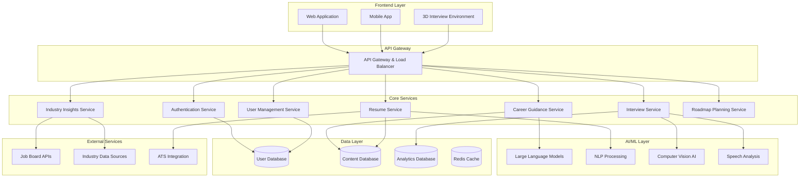

# Design Document

## Overview

Pravartak is designed as a modern, scalable AI-powered learning and productivity platform built on a microservices architecture. The system leverages generative AI models, real-time data processing, and immersive technologies to deliver personalized learning experiences and career guidance.

The platform follows a modular design approach where each core feature (resume creation, interview preparation, career guidance, etc.) operates as an independent service while sharing common infrastructure for user management, AI processing, and data analytics.

## Architecture

### High-Level Architecture



### Technology Stack

**Frontend:**
- React.js/Next.js for web application
- React Native for mobile applications
- Three.js/WebGL for 3D interview environments
- WebRTC for real-time communication

**Backend:**
- Node.js/Express.js for API services
- Python/FastAPI for AI/ML services
- GraphQL for flexible data querying
- WebSocket for real-time features

**AI/ML:**
- OpenAI GPT models for text generation
- Hugging Face Transformers for specialized NLP tasks
- TensorFlow/PyTorch for custom model training
- OpenCV for computer vision processing

**Database:**
- PostgreSQL for relational data
- MongoDB for document storage
- Redis for caching and session management
- Elasticsearch for search functionality

**Infrastructure:**
- Docker containers for service deployment
- Kubernetes for orchestration
- AWS/Azure for cloud hosting
- CDN for content delivery

## Components and Interfaces

### 1. User Management Component

**Responsibilities:**
- User authentication and authorization
- Profile management and preferences
- Progress tracking and analytics
- Subscription and billing management

**Key Interfaces:**
```typescript
interface UserProfile {
  id: string;
  email: string;
  personalInfo: PersonalInfo;
  careerGoals: CareerGoal[];
  skillAssessments: SkillAssessment[];
  learningPreferences: LearningPreferences;
  subscriptionTier: SubscriptionTier;
}

interface AuthService {
  authenticate(credentials: LoginCredentials): Promise<AuthToken>;
  refreshToken(token: string): Promise<AuthToken>;
  validateToken(token: string): Promise<boolean>;
}
```

### 2. AI Career Guidance Component

**Responsibilities:**
- Personalized learning path generation
- Skill gap analysis and recommendations
- Career transition planning
- Progress monitoring and adaptation

**Key Interfaces:**
```typescript
interface CareerGuidanceService {
  generateLearningPath(profile: UserProfile, goals: CareerGoal[]): Promise<LearningPath>;
  analyzeSkillGaps(currentSkills: Skill[], targetRole: JobRole): Promise<SkillGapAnalysis>;
  updateRecommendations(userId: string, progress: LearningProgress): Promise<Recommendation[]>;
}

interface LearningPath {
  id: string;
  milestones: Milestone[];
  estimatedDuration: number;
  resources: LearningResource[];
  assessments: Assessment[];
}
```

### 3. Resume & Cover Letter Component

**Responsibilities:**
- AI-powered resume generation and optimization
- ATS compatibility analysis
- Cover letter personalization
- Template management and customization

**Key Interfaces:**
```typescript
interface ResumeService {
  generateResume(profile: UserProfile, targetRole: JobRole): Promise<Resume>;
  optimizeForATS(resume: Resume, jobDescription: string): Promise<OptimizationSuggestions>;
  analyzeResume(resumeContent: string): Promise<ResumeAnalysis>;
}

interface CoverLetterService {
  generateCoverLetter(profile: UserProfile, jobPosting: JobPosting): Promise<CoverLetter>;
  customizeCoverLetter(template: CoverLetter, customizations: Customization[]): Promise<CoverLetter>;
}
```

### 4. Interview Preparation Component

**Responsibilities:**
- Question generation based on role and experience
- 3D mock interview environment management
- Speech and behavior analysis
- Performance feedback and improvement suggestions

**Key Interfaces:**
```typescript
interface InterviewService {
  generateQuestions(role: JobRole, difficulty: DifficultyLevel): Promise<InterviewQuestion[]>;
  startMockInterview(userId: string, interviewConfig: InterviewConfig): Promise<InterviewSession>;
  analyzeResponse(response: InterviewResponse): Promise<ResponseAnalysis>;
  generateFeedback(session: InterviewSession): Promise<InterviewFeedback>;
}

interface MockInterviewEnvironment {
  initializeVirtualEnvironment(config: EnvironmentConfig): Promise<VirtualEnvironment>;
  processAudioVideo(stream: MediaStream): Promise<AnalysisData>;
  generateAvatarInterviewer(interviewerType: InterviewerType): Promise<VirtualInterviewer>;
}
```

### 5. Industry Insights Component

**Responsibilities:**
- Real-time data aggregation from multiple sources
- Trend analysis and prediction
- Skill demand forecasting
- Technology adoption tracking

**Key Interfaces:**
```typescript
interface IndustryInsightsService {
  getMarketTrends(industry: Industry, timeframe: TimeFrame): Promise<MarketTrend[]>;
  getSkillDemand(skills: string[], location?: string): Promise<SkillDemandData>;
  getTechnologyInsights(technologies: string[]): Promise<TechnologyInsight[]>;
  subscribeToUpdates(userId: string, interests: string[]): Promise<Subscription>;
}
```

## Data Models

### Core Data Models

```typescript
// User and Profile Models
interface User {
  id: string;
  email: string;
  passwordHash: string;
  createdAt: Date;
  lastLoginAt: Date;
  subscriptionTier: 'free' | 'premium' | 'enterprise';
}

interface UserProfile {
  userId: string;
  personalInfo: {
    firstName: string;
    lastName: string;
    location: string;
    phoneNumber?: string;
  };
  professionalInfo: {
    currentRole?: string;
    experience: ExperienceEntry[];
    education: EducationEntry[];
    skills: Skill[];
    certifications: Certification[];
  };
  preferences: {
    learningStyle: 'visual' | 'auditory' | 'kinesthetic' | 'mixed';
    availableHours: number;
    preferredLanguages: string[];
    notificationSettings: NotificationSettings;
  };
}

// Career and Learning Models
interface CareerGoal {
  id: string;
  targetRole: string;
  targetIndustry: string;
  timeframe: number; // months
  priority: 'high' | 'medium' | 'low';
  status: 'active' | 'completed' | 'paused';
}

interface LearningPath {
  id: string;
  userId: string;
  goalId: string;
  milestones: Milestone[];
  currentMilestone: number;
  progress: number; // percentage
  estimatedCompletion: Date;
}

interface Milestone {
  id: string;
  title: string;
  description: string;
  skills: string[];
  resources: LearningResource[];
  assessments: Assessment[];
  isCompleted: boolean;
  completedAt?: Date;
}

// Resume and Application Models
interface Resume {
  id: string;
  userId: string;
  content: ResumeContent;
  atsScore: number;
  lastOptimized: Date;
  versions: ResumeVersion[];
}

interface ResumeContent {
  personalInfo: PersonalInfo;
  summary: string;
  experience: ExperienceEntry[];
  education: EducationEntry[];
  skills: string[];
  achievements: string[];
  certifications: Certification[];
}

// Interview Models
interface InterviewSession {
  id: string;
  userId: string;
  type: '2d' | '3d' | 'voice-only';
  role: string;
  questions: InterviewQuestion[];
  responses: InterviewResponse[];
  analysis: SessionAnalysis;
  feedback: InterviewFeedback;
  startedAt: Date;
  completedAt?: Date;
}

interface InterviewQuestion {
  id: string;
  text: string;
  category: 'technical' | 'behavioral' | 'situational';
  difficulty: 'easy' | 'medium' | 'hard';
  expectedDuration: number; // seconds
}

interface InterviewResponse {
  questionId: string;
  audioData?: Blob;
  videoData?: Blob;
  transcription: string;
  duration: number;
  confidence: number;
  bodyLanguageAnalysis?: BodyLanguageAnalysis;
}
```

## Error Handling

### Error Classification

**Client Errors (4xx):**
- 400 Bad Request: Invalid input data or malformed requests
- 401 Unauthorized: Authentication required or invalid credentials
- 403 Forbidden: Insufficient permissions for requested action
- 404 Not Found: Requested resource does not exist
- 429 Too Many Requests: Rate limiting exceeded

**Server Errors (5xx):**
- 500 Internal Server Error: Unexpected server-side errors
- 502 Bad Gateway: AI service unavailable or timeout
- 503 Service Unavailable: Temporary service maintenance
- 504 Gateway Timeout: AI processing timeout

### Error Handling Strategy

```typescript
interface ErrorResponse {
  error: {
    code: string;
    message: string;
    details?: any;
    timestamp: string;
    requestId: string;
  };
}

class ErrorHandler {
  static handleAIServiceError(error: AIServiceError): ErrorResponse {
    // Log error for monitoring
    logger.error('AI Service Error', { error, requestId: error.requestId });
    
    // Return user-friendly error
    return {
      error: {
        code: 'AI_SERVICE_UNAVAILABLE',
        message: 'AI service is temporarily unavailable. Please try again.',
        timestamp: new Date().toISOString(),
        requestId: error.requestId
      }
    };
  }
  
  static handleValidationError(validationErrors: ValidationError[]): ErrorResponse {
    return {
      error: {
        code: 'VALIDATION_FAILED',
        message: 'Input validation failed',
        details: validationErrors,
        timestamp: new Date().toISOString(),
        requestId: generateRequestId()
      }
    };
  }
}
```

### Retry and Fallback Mechanisms

- **AI Service Failures:** Implement exponential backoff with circuit breaker pattern
- **Database Timeouts:** Use read replicas and connection pooling
- **External API Failures:** Cache responses and provide stale data when appropriate
- **Real-time Features:** Graceful degradation to polling when WebSocket fails

## Testing Strategy

### Testing Pyramid

**Unit Tests (70%):**
- Individual service methods and functions
- Data model validation and transformation
- AI prompt engineering and response parsing
- Business logic validation

**Integration Tests (20%):**
- API endpoint testing with real database
- AI service integration testing
- External API integration testing
- Database query optimization testing

**End-to-End Tests (10%):**
- Complete user workflows (registration to career guidance)
- Cross-service communication testing
- Performance testing under load
- 3D interview environment functionality

### AI-Specific Testing

```typescript
describe('AI Career Guidance Service', () => {
  it('should generate relevant learning paths for software engineer role', async () => {
    const mockProfile = createMockUserProfile({
      currentRole: 'junior developer',
      skills: ['javascript', 'react'],
      goals: [{ targetRole: 'senior software engineer' }]
    });
    
    const learningPath = await careerGuidanceService.generateLearningPath(
      mockProfile, 
      mockProfile.goals
    );
    
    expect(learningPath.milestones).toHaveLength(greaterThan(3));
    expect(learningPath.milestones[0].skills).toContain('system design');
    expect(learningPath.estimatedDuration).toBeLessThan(24); // months
  });
  
  it('should handle AI service timeouts gracefully', async () => {
    mockAIService.mockImplementation(() => 
      new Promise(resolve => setTimeout(resolve, 10000))
    );
    
    const result = await careerGuidanceService.generateLearningPath(
      mockProfile, 
      mockGoals
    );
    
    expect(result).toEqual(expect.objectContaining({
      error: 'AI_SERVICE_TIMEOUT',
      fallbackRecommendations: expect.any(Array)
    }));
  });
});
```

### Performance Testing

- **Load Testing:** Simulate 1000+ concurrent users using career guidance features
- **AI Response Time:** Ensure 95% of AI-generated content responds within 5 seconds
- **3D Environment Performance:** Maintain 60fps in mock interview environments
- **Database Performance:** Query response times under 100ms for user data retrieval

### Security Testing

- **Authentication Testing:** Verify JWT token validation and refresh mechanisms
- **Authorization Testing:** Ensure proper role-based access control
- **Input Validation:** Test for SQL injection, XSS, and other common vulnerabilities
- **AI Prompt Injection:** Validate AI services against malicious prompt injection attempts
- **Data Privacy:** Verify PII handling and GDPR compliance measures